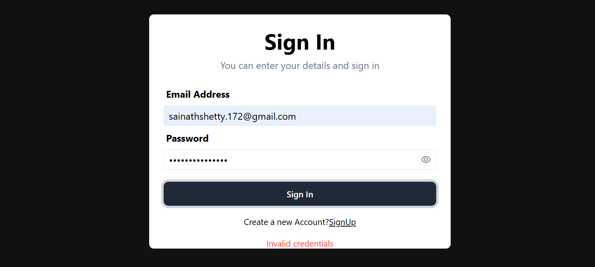
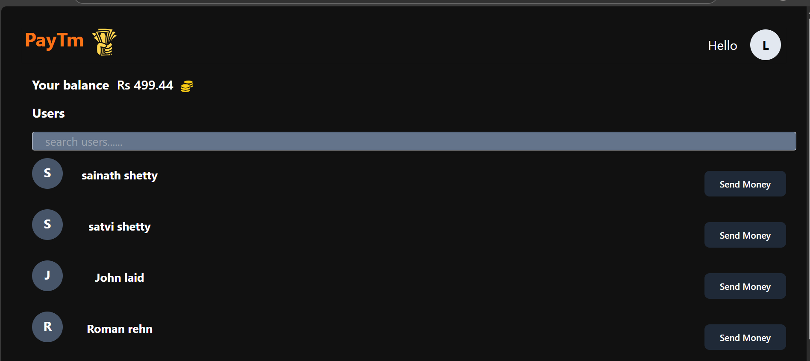

# Cashex 💸

Cashex is a full-stack money transfer web application inspired by PayTM. Users can sign up, log in, check their balance, and instantly send money to other registered users.

---

## Screenshots & Demo

### Sign Up


### Sign In


### Dashboard


### Money Transfer Demo

https://github.com/sainath-shetty/Cashex/blob/main/Assets/money%20sending%20video.mp4

---

## Features

- User Sign Up & Sign In with JWT-based authentication
- Per-tab sessions using `sessionStorage` (multiple users can be logged in simultaneously in different tabs)
- Real-time balance updates via polling every 5 seconds — no manual refresh needed
- Send money to other users instantly
- Password show/hide toggle on all auth forms
- Dockerized with Nginx reverse proxy for production-like setup
- Kubernetes manifests with a dedicated `cashex` namespace for orchestration

---

## Tech Stack

| Layer            | Technology                       |
| ---------------- | -------------------------------- |
| Frontend         | React, Vite, Tailwind CSS, Axios |
| Backend          | Node.js, Express.js              |
| Database         | MongoDB Atlas (via Mongoose)     |
| Auth             | JWT (JSON Web Tokens) + bcrypt   |
| Validation       | Zod                              |
| Containerization | Docker, Docker Compose           |
| Reverse Proxy    | Nginx                            |
| Orchestration    | Kubernetes                       |

---

## Project Structure

```
Cashex/
├── backend/                  # Express.js REST API
│   ├── index.js              # Entry point, starts server on port 9000
│   ├── db.js                 # MongoDB connection + Mongoose schemas
│   ├── middleware.js         # JWT auth middleware
│   ├── vercel.json           # Vercel deployment config
│   └── routes/
│       ├── index.js          # Root router
│       ├── user.js           # /signup, /signin, /update, /bulk
│       └── account.js        # /balance, /transfer
│
├── frontend/                 # React + Vite SPA
│   ├── src/
│   │   ├── apiConfig.js      # Centralized API base URL
│   │   ├── App.jsx           # Route definitions
│   │   ├── pages/
│   │   │   ├── SignUp.jsx
│   │   │   ├── SignIn.jsx
│   │   │   ├── Dashboard.jsx # Shows balance + user list (polls every 5s)
│   │   │   └── SendMoney.jsx
│   │   └── assets/
│   │       └── RequiredCompo.jsx  # Reusable UI components
│   ├── nginx.conf            # Nginx config: serves React + proxies /api/v1 to backend
│   └── Dockerfile            # Multi-stage: Node build → Nginx serve
│
├── k8s/                      # Kubernetes manifests
│   ├── namespace.yaml
│   ├── backend-deployment.yaml
│   ├── backend-service.yaml
│   ├── frontend-deployment.yaml
│   ├── frontend-service.yaml
│   ├── frontend-nginx-configmap.yaml
│   └── create-secrets.sh
│
├── docker-compose.yml        # Runs frontend + backend together locally
└── README.md
```

---

## Running Locally (Without Docker)

### Prerequisites

- [Node.js](https://nodejs.org/) v18 or higher
- A MongoDB Atlas account (free tier) — [cloud.mongodb.com](https://cloud.mongodb.com)

### Step 1 — Set up the Backend

```bash
cd backend
npm install
```

Create a `.env` file inside the `backend/` folder:

```
JWT_SECRET_KEY=your_super_secret_key_change_this
MONGO_URI=mongodb+srv://<username>:<password>@cluster0.xxxx.mongodb.net/auth
```

> **Why these variables?**
>
> - `JWT_SECRET_KEY` — used to sign and verify JWT tokens for auth
> - `MONGO_URI` — your MongoDB Atlas connection string. Get it from Atlas → Connect → Drivers

Start the backend server:

```bash
npm start
```

The backend runs at `http://localhost:9000`

---

### Step 2 — Set up the Frontend

Open a **new terminal**:

```bash
cd frontend
npm install
npm run dev
```

The frontend runs at `http://localhost:5173`

> Vite automatically proxies all `/api/v1` requests to `http://localhost:9000` (configured in `vite.config.js`), so no CORS issues during development.

---

### Step 3 — Open the App

Go to `http://localhost:5173` in your browser.

- Sign up with two different accounts in two separate tabs
- Both sessions are independent — each tab stores its own JWT token in `sessionStorage`
- Transfer money between them and watch the balance update automatically within 5 seconds

---

## Running with Docker Compose (Recommended)

Docker Compose builds and runs both frontend and backend as containers, with Nginx automatically proxying API calls — no separate terminals needed.

### Prerequisites

- [Docker Desktop](https://www.docker.com/products/docker-desktop/) installed and running

### Step 1 — Create the root `.env` file

Create a `.env` file in the **root** `Cashex/` folder (next to `docker-compose.yml`):

```
JWT_SECRET_KEY=your_super_secret_key_change_this
MONGO_URI=mongodb+srv://<username>:<password>@cluster0.xxxx.mongodb.net/auth
```

> Docker Compose reads this file automatically and injects these values into the backend container as environment variables.

### Step 2 — Build and start all containers

```bash
docker compose up --build
```

> `--build` forces Docker to rebuild both images from scratch. Use it whenever you change code.
> Omit `--build` on subsequent runs if no code has changed — containers start faster.

### Step 3 — Open the App

Go to `http://localhost:3000` in your browser.

**What's running:**

| Container         | Role                    | Port          |
| ----------------- | ----------------------- | ------------- |
| `cashex-frontend` | Nginx serving React app | `3000 → 80`   |
| `cashex-backend`  | Express.js API          | `9000 → 9000` |

Nginx inside the frontend container routes all `/api/v1/*` requests to the backend container — the frontend never talks to the backend directly.

### Other useful Docker commands

```bash
# Run in background (detached mode)
docker compose up --build -d

# View live logs when running in background
docker compose logs -f

# Stop and remove containers
docker compose down

# Check container status
docker compose ps
```

---

## API Endpoints

### Auth — `/api/v1/user`

| Method | Endpoint        | Description                          |
| ------ | --------------- | ------------------------------------ |
| POST   | `/signup`       | Register a new user                  |
| POST   | `/signin`       | Login, returns JWT token             |
| PUT    | `/update`       | Update user profile (auth required)  |
| GET    | `/bulk?filter=` | Search users by name (auth required) |

### Account — `/api/v1/account`

| Method | Endpoint    | Description                                    |
| ------ | ----------- | ---------------------------------------------- |
| GET    | `/balance`  | Get current user's balance (auth required)     |
| POST   | `/transfer` | Transfer money to another user (auth required) |

> All protected endpoints require the header: `Authorization: Bearer <token>`

---

## Deploying to Production

### Backend → Vercel

```bash
cd backend
npx vercel
```

Add environment variables in Vercel dashboard → Settings → Environment Variables:

- `JWT_SECRET_KEY`
- `MONGO_URI`

### Frontend → Vercel

Update `src/apiConfig.js` with your deployed backend URL:

```js
const API_BASE =
  import.meta.env.VITE_API_URL || "https://your-backend.vercel.app";
```

Then deploy:

```bash
cd frontend
npx vercel
```

---

## Kubernetes (Learning / Scaling)

Kubernetes runs 2 replicas of each service, load balancing traffic across pods.

### Prerequisites

- [Minikube](https://minikube.sigs.k8s.io/docs/start/) installed and running
- `kubectl` installed

```bash
minikube start
```

---

### ⚠️ Critical: Minikube has its own Docker daemon

Minikube runs its own **isolated Docker daemon** inside a VM. It cannot see images built on your host machine (including those built by `docker compose up --build`).

You **must** point your shell to Minikube's Docker daemon before building images, otherwise:

- `docker build` will finish instantly (using host cache) but land in the wrong place
- Kubernetes will throw `ErrImageNeverPull` — it can't find the images

> This must be done once per terminal session. If you open a new tab, run it again.

---

### Step-by-step Deployment

**Step 1 — Point your shell to Minikube's Docker daemon**

```bash
eval $(minikube docker-env)
```

**Step 2 — Build images inside Minikube**

> This will be slower than host builds since Minikube has no cache on first run. Subsequent builds will be faster.

```bash
cd /path/to/Cashex
docker build -t cashex-backend ./backend
docker build -t cashex-frontend ./frontend

# Verify images exist inside Minikube
docker images | grep cashex
```

**Step 3 — Create the namespace**

```bash
kubectl apply -f k8s/namespace.yaml
```

**Step 4 — Create secrets**

```bash
kubectl create secret generic cashex-secrets \
  --namespace cashex \
  --from-literal=JWT_SECRET_KEY=your_super_secret_key \
  --from-literal=MONGO_URI=mongodb+srv://<user>:<password>@cluster0.xxxx.mongodb.net/auth
```

**Step 5 — Deploy everything**

```bash
kubectl apply -f k8s/
```

**Step 6 — Wait for pods to be Running**

```bash
kubectl get pods -n cashex -w
```

Expected output — all 4 pods `Running`:

```
NAME                                   READY   STATUS    RESTARTS   AGE
backend-deployment-xxx                 1/1     Running   0          30s
backend-deployment-yyy                 1/1     Running   0          30s
frontend-deployment-xxx                1/1     Running   0          30s
frontend-deployment-yyy                1/1     Running   0          30s
```

**Step 7 — Open the app**

```bash
minikube service frontend-service -n cashex
```

> This automatically opens the correct URL in your browser, handling the NodePort mapping for you.

---

### Rebuilding after code changes

Every time you change code, you must rebuild **inside Minikube's daemon**:

```bash
eval $(minikube docker-env)   # if in a new terminal tab
docker build -t cashex-backend ./backend
docker build -t cashex-frontend ./frontend
kubectl rollout restart deployment/backend-deployment -n cashex
kubectl rollout restart deployment/frontend-deployment -n cashex
```

---

### Useful commands

```bash
kubectl get pods -n cashex
kubectl get services -n cashex
kubectl logs -n cashex <pod-name>
kubectl describe pod -n cashex <pod-name>
kubectl rollout restart deployment/backend-deployment -n cashex
kubectl rollout restart deployment/frontend-deployment -n cashex
```
